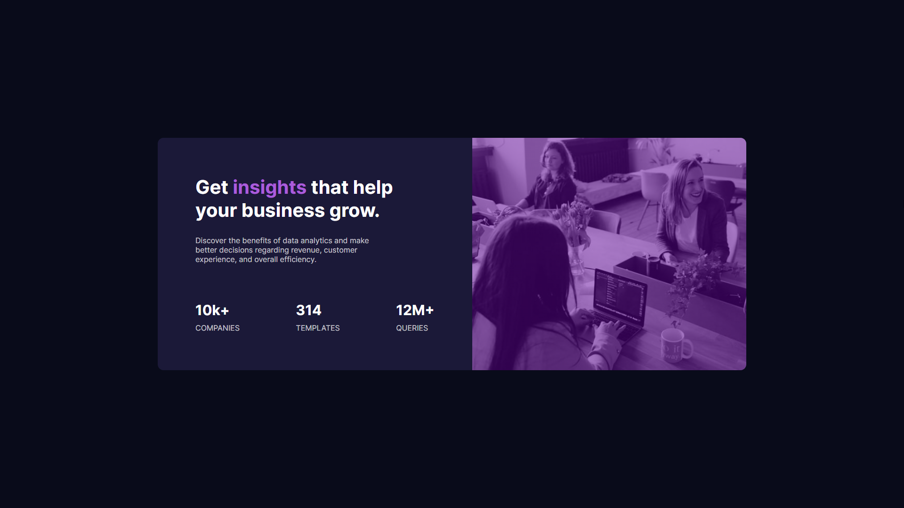

# Stats Preview Card Component

This is a solution to the [Stats preview card component challenge on Frontend Mentor](https://www.frontendmentor.io/challenges/stats-preview-card-component-8JqbgoU62). Frontend Mentor challenges help you improve your coding skills by building realistic projects. 

## Table of contents

- [Overview](#overview)
  - [The challenge](#the-challenge)
  - [Screenshot](#screenshot)
  - [Links](#links)
- [My process](#my-process)
  - [Built with](#built-with)
  - [What I learned](#what-i-learned)
- [Author](#author)

## Overview

### The challenge

Users should be able to:

- View the optimal layout depending on their device's screen size

### Screenshot



### Links

- [Solution](https://www.frontendmentor.io/challenges/stats-preview-card-component-8JqbgoU62/hub/responsive-stats-card-using-html5-sass-and-bem-methodology-7h2GBEldm)
- [Live Site](https://codeline0.github.io/Stats-Preview-Card/)

## My process

### Built with

- Semantic HTML5 markup
- [Sass](https://sass-lang.com/)
- [BEM](http://getbem.com/) methodology
- Flexbox
- Desktop-first workflow
- Responsive Design

### What I learned

You cannot overlap a color directly with a background image, you have to use a gradient.

```css
.card__img {
  background-image: linear-gradient($overlay), url(../images/image-header-desktop.jpg);
}
```

## Author

- Frontend Mentor - [@Codeline0](https://www.frontendmentor.io/profile/Codeline0)
- Marco Camez - [@Codeline0](https://www.github.com/CodeLine0)

